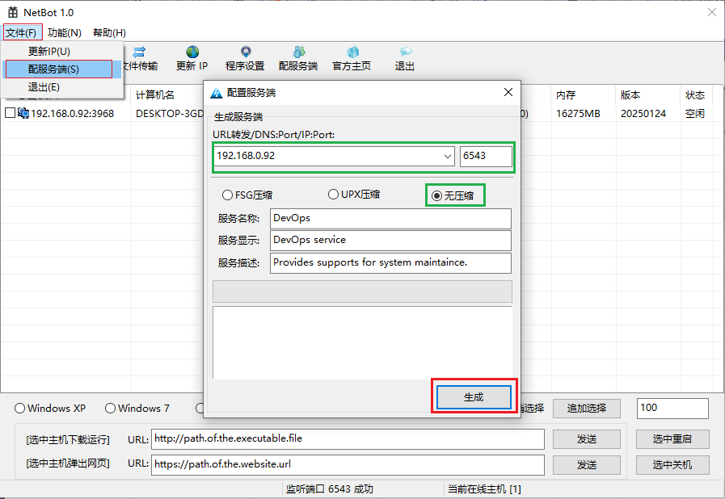
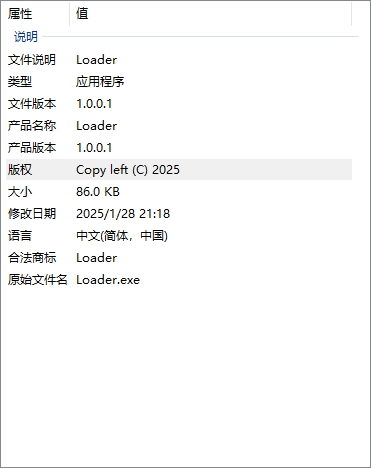
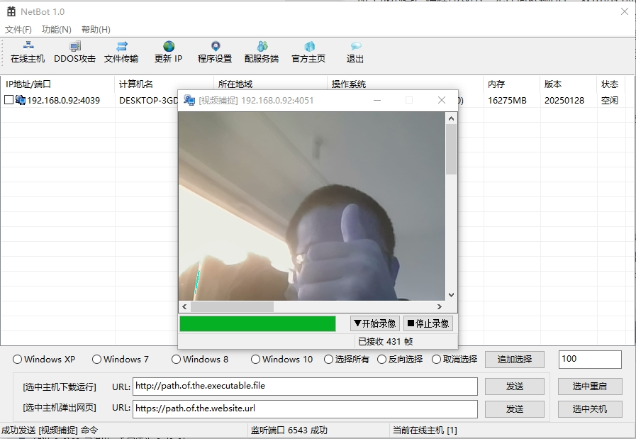

# NetBot

## 1. 项目介绍

网络僵尸是受控的受感染设备（通常是电脑、服务器、IoT 设备等）的集合，这些设备被恶意软件感染并变成攻击者的工具。攻击者通过远程控制这些僵尸设备，实施各种类型的网络攻击。

**僵尸设备**：被恶意软件（如木马、病毒）感染的设备，通常无主人的知晓。在此项目中，由svchost和Loader控制僵尸设备。

**控制端**：由攻击者掌控的服务器或指挥系统，用于发送攻击命令。在此项目中，NetBot作为控制端程序。


软件的原始代码来源不详，可能是[Netbot Attacker 5.5](https://download.csdn.net/download/libo879879/1945316)，也可能是[NetBot
](https://github.com/Ph0enixxx/NetBot)。原始代码无法正常运行，存在诸多问题。经过我的修改，当前程序的稳定性尚可。

## 2. 程序概览

**编译工具**：Visual Studio 2019

NetBot具有比较丰富的功能，诸如在线主机维护、DDOS、文件管理、屏幕监控、Shell终端、参数配置和服务生成等功能。
以下是NetBot主控端运行的一些界面截图。


## 3. 免责声明
本人出于研究之目的，对NetBot的源代码进行深入学习、分析和修改。项目代码仅限于学习和交流用途。

## 4. 代码风格

```bat
for /R %F in (*.cpp *.h) do astyle --style=linux "%F"
```

## 5. 使用说明

### 5.1 生成客户端



启动主控程序，通过“文件”——>“配服务端”打开服务生成对话框，输入主控程序IP（或者域名）和端口，点击“生成”按钮即可。
注意，FSG和UPX加壳功能不可用，如果有需要，请单独额外进行加壳操作。

### 5.2 启动客户端



所生成的客户端程序较小，无任何依赖DLL，双击运行即可。启动之后，此程序会尝试连接主控程序，一旦连接完成，
主控程序会向客户端程序发送核心"svchost.dll"。为此需要保证"svchost.dll"和主控程序在同一个目录。
客户端程序在收到核心DLL之后，将其加载到内存运行。

### 5.3 监控和控制



当客户端程序和主控程序建立连接之后，就可以通过主控程序进行监控和控制了。注意，本项目仅限于学习和交流用途。

## 6. 更新记录
- **[2025/01/25]**

首次发布经过本人修改的代码，程序可正常运行，主要功能可以使用，但是仍然存在一些缺陷。因为Loader在内存中运行DLL，出现问题难以排查。
我新增了一个单独项目`TestDll`，加载本地`svchost.dll`。用于调试和解决程序缺陷。

- **[2025/01/28]**

修复了一些严重问题:

https://github.com/yuanyuanxiang/NetBot/pull/8

https://github.com/yuanyuanxiang/NetBot/pull/11

程序稳定性得到大幅提升。发布第一个版本，可以在 [Releases](https://github.com/yuanyuanxiang/NetBot/releases) 页面进行下载。
本人视空闲情况会不定期更新该项目。如果此项目对你学习有帮助，请您为该项目添加关注和星标。
