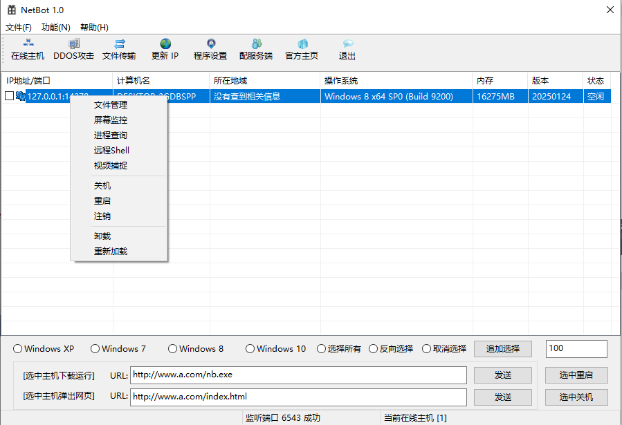
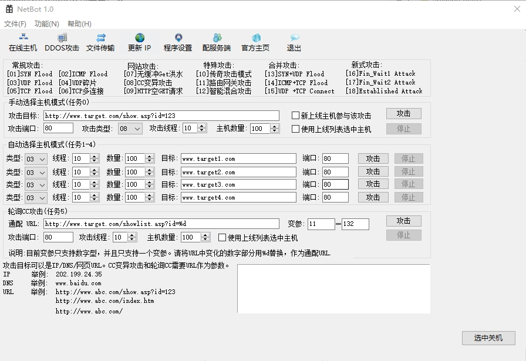
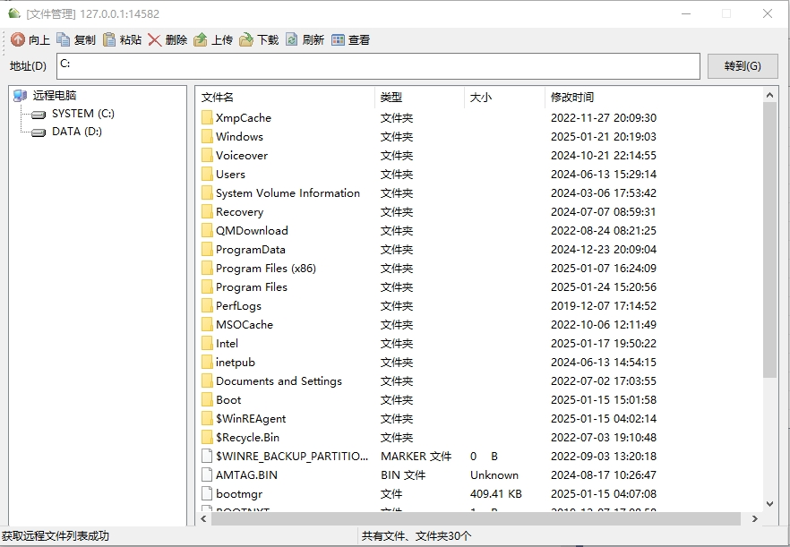
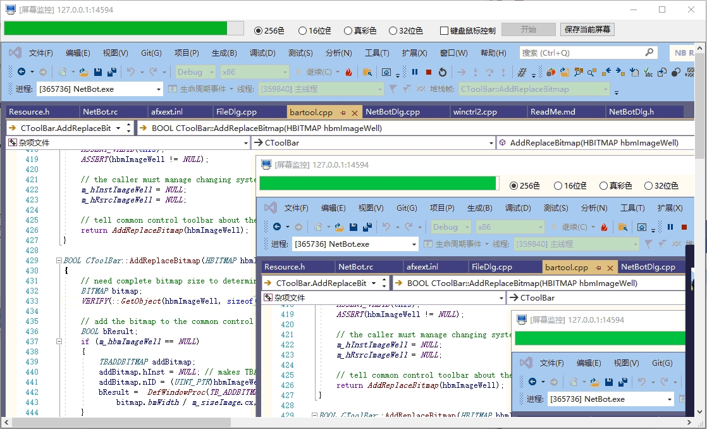
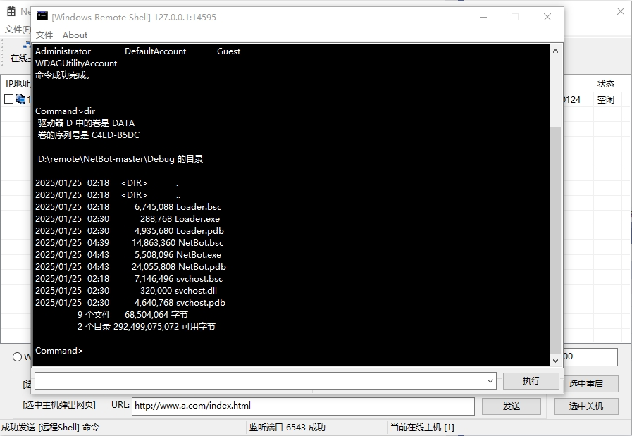
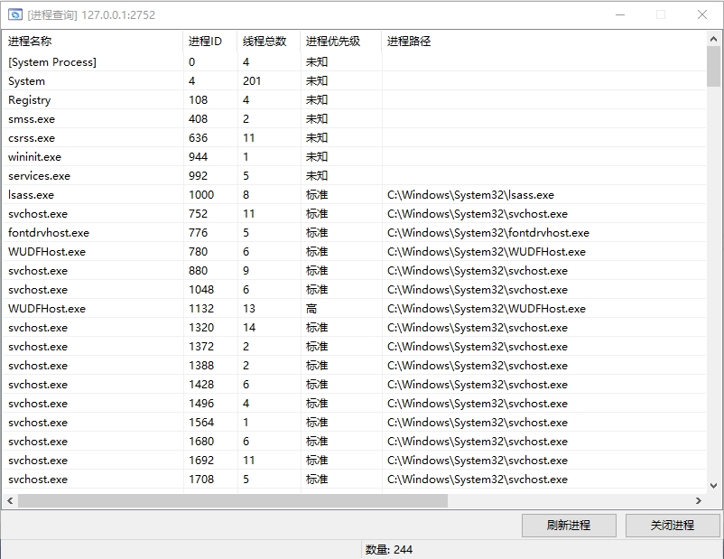

# NetBot

## 1. 项目介绍

网络僵尸是受控的受感染设备（通常是电脑、服务器、IoT 设备等）的集合，这些设备被恶意软件感染并变成攻击者的工具。攻击者通过远程控制这些僵尸设备，实施各种类型的网络攻击。

**僵尸设备**：被恶意软件（如木马、病毒）感染的设备，通常无主人的知晓。在此项目中，由svchost和Loader控制僵尸设备。

**控制端**：由攻击者掌控的服务器或指挥系统，用于发送攻击命令。在此项目中，NetBot作为控制端程序。


软件的原始代码来源不详，可能是[Netbot Attacker 5.5](https://download.csdn.net/download/libo879879/1945316)，也可能是[NetBot
](https://github.com/Ph0enixxx/NetBot)。原始代码无法正常运行，存在诸多问题。经过我的修改，当前程序的稳定性尚可。

## 2. 程序概览

**编译工具**：Visual Studio 2019

NetBot具有比较丰富的功能，诸如在线主机维护、DDOS、文件管理、屏幕监控、Shell终端、参数配置和服务生成等功能。
以下是NetBot主控端运行的一些界面截图。













## 3. 免责声明
本人出于研究之目的，对NetBot的源代码进行深入学习、分析和修改。项目代码仅限于学习和交流用途。

## 4. 代码风格

```bat
for /R %F in (*.cpp *.h) do astyle --style=linux "%F"
```

## 5. 更新记录
- **[2025/01/25]**

首次发布经过本人修改的代码，程序可正常运行，主要功能可以使用，但是仍然存在一些缺陷。因为Loader在内存中运行DLL，出现问题难以排查。
我新增了一个单独项目`TestDll`，加载本地`svchost.dll`。用于调试和解决程序缺陷。
